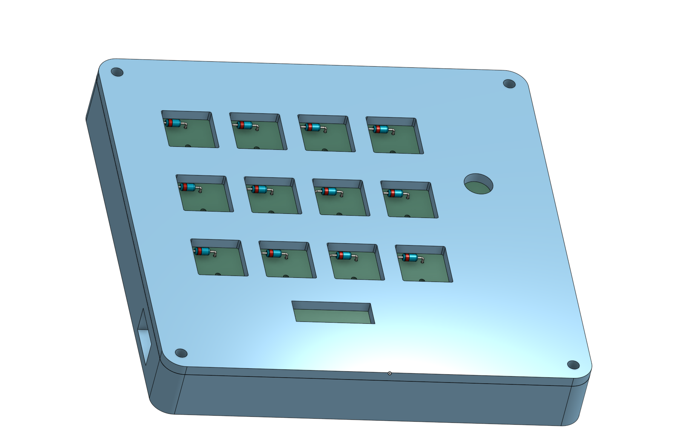
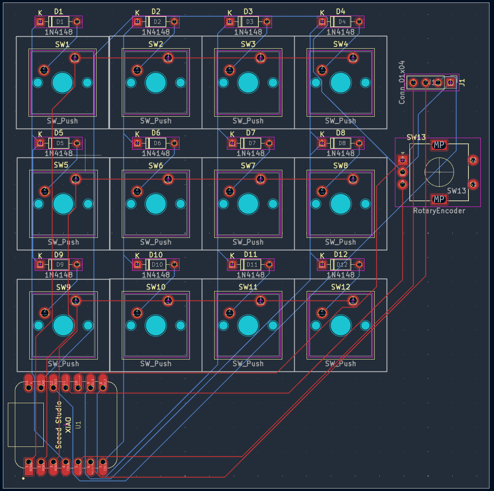
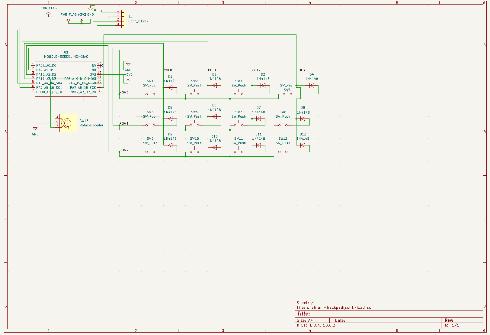
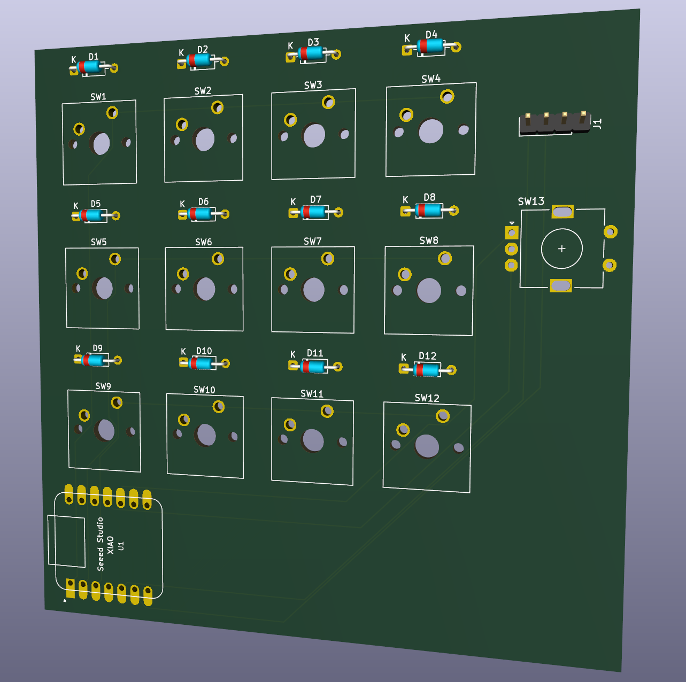
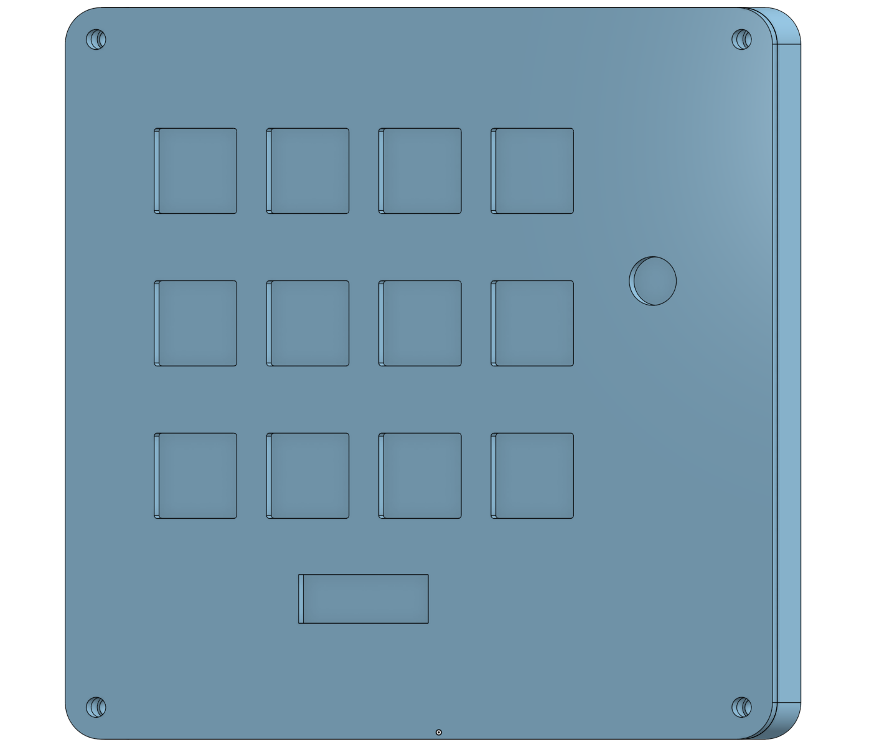

# shehram-hackpad

A custom 12-key macropad with an OLED display, rotary encoder, and 3D printed case.

## Images

### Assembled Model

### PCB Layout

### Schematic

### PCB 3D View

### Case 3D View

## Features

* 12 MX-style switches
* 1 EC11 rotary encoder
* 1 0.91 inch OLED display
* Seeed Studio XIAO RP2040 microcontroller
* 3D printed case and lid
* Custom KiCad PCB
* KMK/CircuitPython firmware
* OLED connected using female-to-female Dupont jumper wires

## CAD

The case was designed as a two-part 3D printed enclosure:

* Bottom case/tray
* Top lid/plate

The CAD files are included in the `CAD/` folder.

Included CAD files:

* `Case.step`
* `Lid.step`
* `Macropad_Assembly.step`

## PCB

The PCB was designed in KiCad. It uses a 3 row by 4 column switch matrix with 1N4148 diodes.

The PCB files are included in the `PCB/` folder.

Included PCB files:

* KiCad schematic file
* KiCad PCB layout file

The production files are included in the `production/` folder.

Included production files:

* `gerbers.zip`

## Firmware

The firmware is written for KMK/CircuitPython and is included in the `Firmware/` folder.

Main firmware file:

* `code.py`

Pin mapping:

Rows:

* ROW0 = D0
* ROW1 = D1
* ROW2 = D2

Columns:

* COL0 = D3
* COL1 = D6
* COL2 = D7
* COL3 = D8

Rotary encoder:

* A = D9
* B = D10
* C = GND

OLED:

* SDA = D4
* SCL = D5
* VCC = 3V3
* GND = GND

## BOM

| Part                                 | Quantity |
| ------------------------------------ | -------- |
| Seeed Studio XIAO RP2040             | 1        |
| MX-style switches                    | 12       |
| 1N4148 diodes                        | 12       |
| EC11 rotary encoder                  | 1        |
| 0.91 inch OLED display               | 1        |
| Female-to-female Dupont jumper wires | 4        |
| M3 screws                            | 6        |
| M3 heat-set inserts                  | 6        |
| 3D printed case                      | 1        |
| 3D printed lid                       | 1        |

## Notes

The OLED is connected with female-to-female Dupont jumper wires instead of being mounted directly over the PCB header. This allows the OLED screen to be positioned in a cleaner location on the lid.

The case and lid are designed to be entirely 3D printed.
